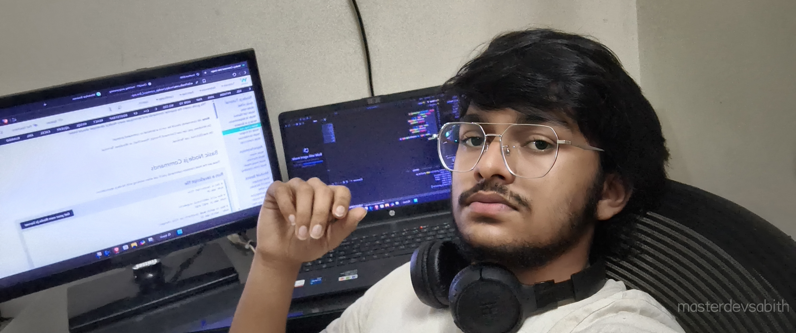

<h1 align="center">Top Skills</h1>

###

  
  
  
  
  
  
  
  
  
  
  
  
  
  
  
  
  
  
  
  
  
  
  
  
  
  
  
  
  

###

<h1 align="center">connect me through...</h1>

###

  
  
  
  

###

  

###

<!--  -->

  
 
Why can't you <b>FOLLOW</b> me ????????????????????

<!--https://profile-readme-generator.com/assets/pacman.svg -->
<!-- https://profile-readme-generator.com/assets/snake.svg -->

###

<!-- <picture>
  <source media="(prefers-color-scheme: dark)" srcset="https://raw.githubusercontent.com/masterdevsabith/masterdevsabith/output/pacman-contribution-graph-dark.svg">
  <source media="(prefers-color-scheme: light)" srcset="https://raw.githubusercontent.com/masterdevsabith/masterdevsabith/output/pacman-contribution-graph.svg">
  
</picture> -->

###

 

  
  
  
  

###

  

###
